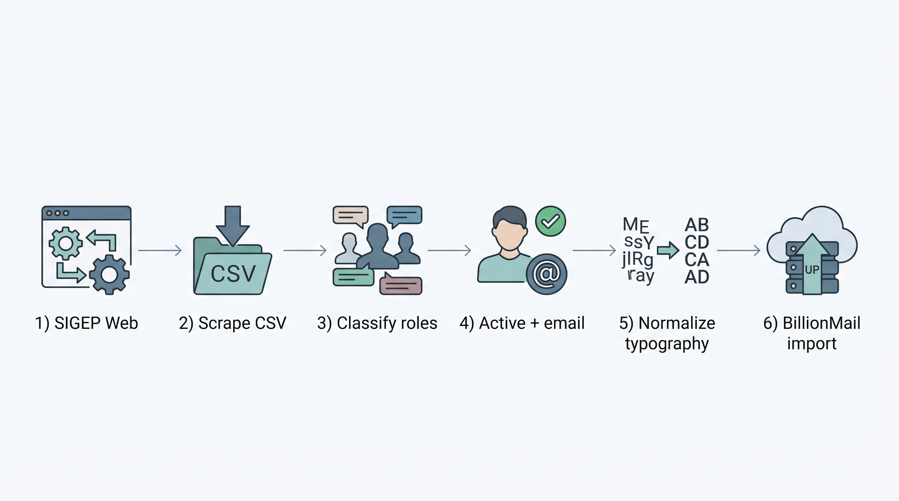

# SIGEP Sales Intelligence

Pipeline en Python para **extracción, segmentación y preparación de leads** a partir del directorio público SIGEP (Función Pública — Colombia).

Diseñado para ventas B2G / outreach a personal de alto rango en entidades públicas (secretario de despacho, director, alcalde, gerente, etc.).



> **Nota:** este repositorio publica **código, documentación y samples sintéticos**. Los datasets con nombres, correos y teléfonos reales **no se versionan** (PII).

---

## Pipeline

```text
SIGEP (web)
    │
    ▼
[1] scraper.py              → CSV por departamento (crudo)
    │
    ▼
[2] classify.py             → reglas de cargo (alto rango sí/no)
    │
[3] clean.py                → classify + solo cargos vigentes
    │                          → limpios_alto_rango/
    ▼
[4] email_ready.py          → subset con correo válido
    │                          → limpios_alto_rango_con_correo/
    ▼
[5] normalize_contacts.py   → tipografía ES + 1 archivo unificado
    │                          (+ text_format.py)
    ▼
[6] billionmail_export.py   → import CSV (email + attributes JSON)
                               → billionmail/02_billionmail_import.csv
```

| Etapa | Salida típica (corrida real, local) |
|-------|-------------------------------------|
| Scraping nacional | ~395 000 filas · 33 departamentos |
| Alto rango + activos | ~21 000 filas |
| Con correo usable | ~13 500 filas |
| Email único + tipografía | ~13 000 filas |
| Import BillionMail | mismo set · formato `email,attributes` |

*(Las cifras exactas dependen de la fecha de corrida y de la calidad de SIGEP. Los CSV reales viven solo en local.)*

---

## Stack

- Python 3.10+
- `requests` + `BeautifulSoup` (scraping)
- `csv` / `json` (I/O y export)
- Regex + normalización Unicode (cargos y tipografía)
- `unittest` (tests del pipeline)

---

## Instalación

```bash
git clone https://github.com/blessed666-code/sigep-sales-intelligence.git
cd sigep-sales-intelligence
python -m venv .venv
source .venv/bin/activate   # Windows: .venv\Scripts\activate
pip install -r requirements.txt
```

---

## Uso

Desde la **raíz del repo**:

```bash
# 1) Extraer (puede tardar horas a escala nacional)
python src/scraper.py

# 2) Segmentar alto rango + vigentes
python src/clean.py

# 3) Quedarse solo con correos válidos
python src/email_ready.py

# 4) Unificar + tipografía para plantillas
python src/normalize_contacts.py

# 5) Export formato BillionMail
python src/billionmail_export.py
```

Tests:

```bash
python -m unittest discover -s tests -v
```

---

## Estructura

```text
sigep-sales-intelligence/
├── README.md
├── LICENSE
├── requirements.txt
├── src/
│   ├── scraper.py
│   ├── classify.py
│   ├── clean.py
│   ├── email_ready.py
│   ├── text_format.py          # tipografía ES / UTF-8-sig
│   ├── normalize_contacts.py   # unificado para plantillas
│   └── billionmail_export.py   # email + attributes
├── docs/
│   ├── architecture.md
│   └── methodology.md
├── sample/
│   ├── sample.csv                 # crudo sintético
│   └── sample_billionmail.csv     # import sintético
├── assets/
│   └── pipeline.png               # diagrama del flujo
└── tests/
```

Carpetas locales **ignoradas por Git** (PII): `limpios_*`, `billionmail/`, `datos_sigep/`, `*.csv` reales.

---

## Documentación

- [Architecture](docs/architecture.md) — flujo técnico
- [Methodology](docs/methodology.md) — cargos, vigencia, tipografía, BillionMail

---

## Samples (ficticios)

| Archivo | Qué demuestra |
|---------|----------------|
| [`sample/sample.csv`](sample/sample.csv) | Columnas del scraping/limpieza |
| [`sample/sample_billionmail.csv`](sample/sample_billionmail.csv) | Formato de import `email` + `attributes` |

Nombres tipo *Ejemplo / Demo / Sample / Muestra / Ficticia* y dominios `@ejemplo.gov.co` / `@demo.gov.co`. **No hay PII real.**

---

## Ética y datos

- Fuente: directorio público de hojas de vida SIGEP (Función Pública).
- Uso responsable: no se publican dumps con datos personales en este repo.
- Código abierto + datos sensibles fuera de Git.

---

## Autor

**Danniel Mena** — ARKA (Bogotá)  
Scraping · data cleaning · sales intelligence

---

## License

MIT — ver [LICENSE](LICENSE).
