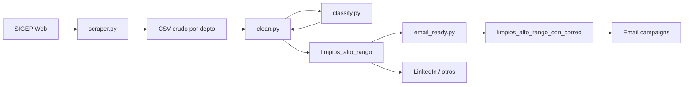

# Architecture

## Objetivo

Convertir el directorio público SIGEP en un set accionable para **sales intelligence** B2G: un CSV por departamento, filtrado a roles con poder de decisión o influencia, vigentes, y opcionalmente con correo para campañas.

## Componentes

| Módulo | Responsabilidad | I/O |
|--------|-----------------|-----|
| `src/scraper.py` | Crawl por departamento/entidad; detalle de perfil | → `datos_sigep/` o `sigep_*.csv` |
| `src/classify.py` | Reglas puras de cargo (sin I/O) | string → bool |
| `src/clean.py` | Aplica classify + filtro de vigencia | `sigep_*.csv` → `limpios_alto_rango/` |
| `src/email_ready.py` | Filtra correos válidos | `limpios_alto_rango/` → `limpios_alto_rango_con_correo/` |

## Flujo de datos

## Columnas (contrato de datos)

Se preservan en todo el pipeline:

1. `Departamento_Filtro`
2. `Entidad_Filtro`
3. `Nombre`
4. `Rol_Contrato`
5. `Cargo_Detallado`
6. `Fecha_Fin_Cargo`
7. `Correo_Perfil`
8. `Telefono_Perfil`
9. `Entidad_Asignada`

## Resiliencia del scraper

- Retries HTTP (`urllib3.Retry`)
- Guardado incremental por entidad
- Workers concurrentes en detalle de perfil
- Delay corto entre páginas para no saturar el origen

## Qué no entra al repo

- CSV reales, Excel, ZIP
- Carpetas `limpios_*` y análisis auxiliares
- Credenciales / `.env`

## Extensiones futuras

- `billionmail_export.py`: mapear columnas al formato de importación de BillionMail
- Deduplicación fuerte por email normalizado
- Validación DNS/MX opcional de correos
