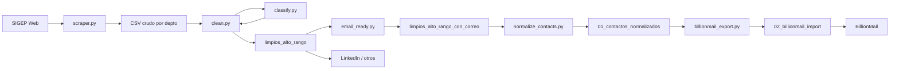

# Architecture

## Objetivo

Convertir el directorio público SIGEP en un set accionable para **sales intelligence** B2G: CSV por departamento, roles con poder de decisión, vigentes, con correo, tipografía lista para plantillas HTML, y export compatible con BillionMail.

## Componentes

| Módulo | Responsabilidad | I/O |
|--------|-----------------|-----|
| `src/scraper.py` | Crawl por departamento/entidad; detalle de perfil | → `sigep_*.csv` |
| `src/classify.py` | Reglas puras de cargo (sin I/O) | string → bool |
| `src/clean.py` | Aplica classify + filtro de vigencia | → `limpios_alto_rango/` |
| `src/email_ready.py` | Filtra correos válidos | → `limpios_alto_rango_con_correo/` |
| `src/text_format.py` | Title case ES, tildes, UTF-8-sig, pulido de cargos | helpers |
| `src/normalize_contacts.py` | Unifica deptos; 1 fila por email | → `billionmail/01_…` |
| `src/billionmail_export.py` | `email` + `attributes` JSON | → `billionmail/02_…` |

## Flujo de datos



## Contratos de datos

### Etapas 1–4 (columnas SIGEP)

1. `Departamento_Filtro`
2. `Entidad_Filtro`
3. `Nombre`
4. `Rol_Contrato`
5. `Cargo_Detallado`
6. `Fecha_Fin_Cargo`
7. `Correo_Perfil`
8. `Telefono_Perfil`
9. `Entidad_Asignada`

### Etapa 5 (normalizado)

`Departamento`, `Nombre`, `Cargo`, `Correo`, `Entidad_Asignada`

### Etapa 6 (BillionMail)

```csv
email,attributes
```

`attributes` es JSON con claves: `department`, `name`, `position`, `assigned_entity`.

## Resiliencia del scraper

- Retries HTTP (`urllib3.Retry`)
- Guardado incremental por entidad
- Workers concurrentes en detalle de perfil
- Delay corto entre páginas para no saturar el origen

## Qué no entra al repo

- CSV reales, Excel, ZIP, TSV de análisis
- Carpetas `limpios_*`, `billionmail/`, `datos_sigep/`
- Credenciales / `.env`

Solo se versionan samples sintéticos en `sample/`.
